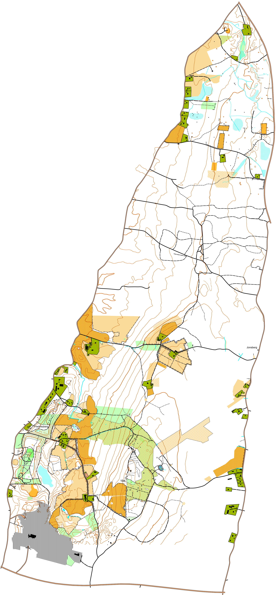
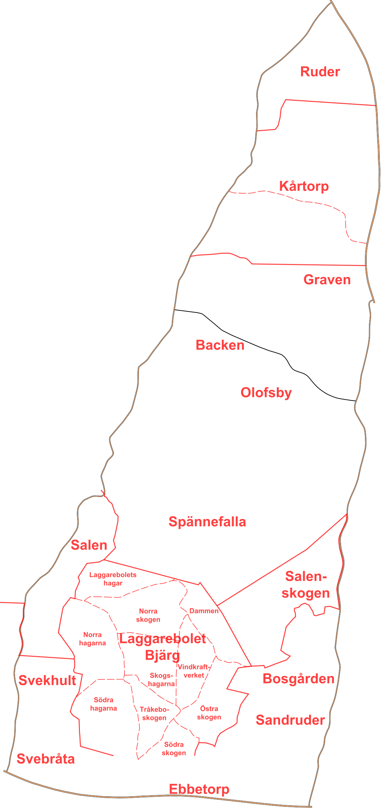

# SalenKartan

Karta över Tibro - Salen, och lite däromkring.

## Begränsning

Kartan är i nuläget begränsad i väster till väg 2908 - Spännefallavägen,
i söder väg 194 - Hjo till Skövdevägen.
I öster väg 201 Tibro-Hjovägen och sedan väg 2910 - Mofallavägen.

Kartan är inte begränsad till kommun, utan både delar i Tibro och Hjo täcks in.

Kartan kan komma att utökas vid senare tillfälle, t.ex. ån Tidan i väster istället för spännefallavägen, väg 201 hela östsidan istället för 2910 - Mofallavägen.

## Status

Status delas in per [trakt](https://sv.wikipedia.org/wiki/Trakt) och del. Trakterna och delarna finns i en separat kartfil, som kan läggas som bakgrundsbild.

| Trakt | Del | Status |
| ------------- | ------------- | ------------- |
| Salen | Byn | Färdig förutom teknisk verifiering av kartnorm. |
| Laggarebolet/Bjärg | Laggarebolets hagar | Jobbar aktivt på. |
| Laggarebolet/Bjärg | Dammen | Grovt ritad, detaljer återstår. |
| Laggarebolet/Bjärg | Norra skogen | Sporadiskt ritad, mycket återstår. |
| Laggarebolet/Bjärg | Norra hagarna | Grovt ritad, detaljer återstår. |
| Laggarebolet/Bjärg | Skogshagarna | Sporadiskt ritad, mycket återstår. |
| Laggarebolet/Bjärg | Vindkraftverket | Sporadiskt ritad, mycket återstår. |
| Laggarebolet/Bjärg | Södra hagarna | Saknar delvis fastighetskarta. Grovt ritad, detaljer återstår. |
| Laggarebolet/Bjärg | Tråkeboskogen | Ej påbörjad. |
| Laggarebolet/Bjärg | Östra skogen | Ej påbörjad. |
| Laggarebolet/Bjärg | Södra skogen | Saknar delvis fastighetskarta. Ej påbörjad. |
| Salen | Skogen | Hyggeskant klar. Mycket återstår. |
| Svekhult | - | Sporadiskt ritad, mycket återstår. |
| Spännefalla | - | Sporadiskt ritad, mycket återstår. |
| Bosgården | - | Sporadiskt ritad, mycket återstår. |
| Sandruder | - | Sporadiskt ritad, mycket återstår. |
| Ebbetorp | - | Sporadiskt ritad, mycket återstår. |
| Svebråta | - | Sporadiskt ritad, mycket återstår. |
| Ruder | - | Material från gammal karta ritad. Höjdkurvor och fältarbete återstår. |
| Kårtorp | Norr Bastavägen | Material från gammal karta ritad. Höjdkurvor och fältarbete återstår. |
| Kårtorp | Söder Bastavägen | Sporadiskt ritad från gammal karta, mycket återstår. |
| Olofsby | - | Ej påbörjad. |
| Backen | - | Ej påbörjad. |

## Kartnorm

Kartan är ritad enligt nu gällande kartnorm ISOM 2017-2

https://www.svenskorientering.se/Arrangera/kartfragor/stoddokumentochfiler/

## Kartritnngsprogram

[Open Orienteering Mapper](https://www.openorienteering.org/apps/mapper/)

## Grundmaterial

### Laserdata

Hämtas från lantmäteriet

För närvarande är det [Laserdata NH](https://www.lantmateriet.se/sv/Kartor-och-geografisk-information/geodataprodukter/produktlista/laserdata-nh/) från 2009 som gäller. Filer hämtas från [Geodataplatsen](https://www.lantmateriet.se/sv/Om-Lantmateriet/Samverkan-med-andra/Geodatasamverkan/Geodataplatsen/), som tyvärr kräver inloggning som man får genom avtal om geodatasamverkan.

[Laserdata Nedladdning, skog](https://www.lantmateriet.se/sv/Kartor-och-geografisk-information/geodataprodukter/produktlista/laserdata-nedladdning-skog/) ca 2023

#### Program

[karttapullautin](http://www.routegadget.net/karttapullautin/)

[OL Laser](https://oapp.se/Applikationer/OL_Laser.html)

[Laserscan tool](https://www.openorienteering.org/apps/laserscan-tool/)
Inte testat ännu

### Fastighetskartan (inkl topografiska kartan)

Hämtas från lantmäteriet

https://www.lantmateriet.se/sv/Kartor-och-geografisk-information/geodataprodukter/produktlista/fastighetskartan/

Lägg till som bakgrundsbilder.

#### Fastighetsindelning

- AL - Linjeskikt med gränser

#### Bebyggelse

- BY - Ytskikt med byggnader

#### Hydrografi

- HL - Linjeskikt med hydrografi
- MV - Ytskikt med vatten

#### Kommunikation

- VL - Linjeskikt med vägar

### Skogsstyrelsen

[Skogliga grunddata](https://www.skogsstyrelsen.se/sjalvservice/karttjanster/skogliga-grunddata/)

[Ladda ner geodata via klickbara länkar](https://www.skogsstyrelsen.se/sjalvservice/karttjanster/geodatatjanster/nerladdning-av-geodata/)

### Gammal karta över Kårtorp

Första version från 1998.

Andra version renritad 2000.

### Karttjänster

[Map Puzzle](http://www.mappuzzle.se/) kan användas för att tanka ned georefererade bakgrundsbilder från mängder med tjänster. Bocka för "Generate world file" och välj formatet Lat/Lon.

När bakgrundsbilden öppnas i OOM, välj först Georefererad, och sedan "Koordinater (WGS84)".

### GPS-Rutter

Ut och spring!

GPX med flera kan antingen importeras eller öppnas som bakgrundsbild.

### Live-GPS

GPS-mottagare som kommunicerar NMEA över COM-port kan anslutas till OOM, men det är lite knöligt att få igång.

En billig [NEO-6M](https://www.electroschematics.com/neo-6m-gps-module/) från Ebay fungerar fint.

Den behöver dock [konfigureras om till baudrate 4800](https://www.navilock.com/service/fragen/gruppe_59_uCenter/beitrag/40_uBlox-and-Change-the-Baudrate.html).

[Live-GPS using NMEA on Windows](https://github.com/OpenOrienteering/mapper/issues/1944)

### Verktyg

[Visual Studio Code](https://code.visualstudio.com/)

[Geo Data Viewer](https://marketplace.visualstudio.com/items?itemName=RandomFractalsInc.geo-data-viewer) Verktyg för att förhandsgranska GPX-filer i Visual Studio Code

[More Revision-Control-friendly file format](https://github.com/OpenOrienteering/mapper/issues/1290)

### Skicka till handhållen Garmin-GPS

[Dakota 20](https://buy.garmin.com/sv-SE/SE/p/30926)

[KMZ/KML](https://en.wikipedia.org/wiki/Keyhole_Markup_Language)

[Garmin Support Center>General Guidelines for Creating Garmin Custom Maps](https://support.garmin.com/en-GB/?faq=FtEncUXbaE0xE04yZ7gTq5)

### ocad2tiles

`npm install -g ocad2tiles`

`ocad2tiles -f #ffffff samples\2021-05-26.ocd ocad2tiles`

`docker build -t salen-kartan ocad2tiles`

`docker run -it --rm -p 8080:80 --name salen-kartan salen-kartan`
